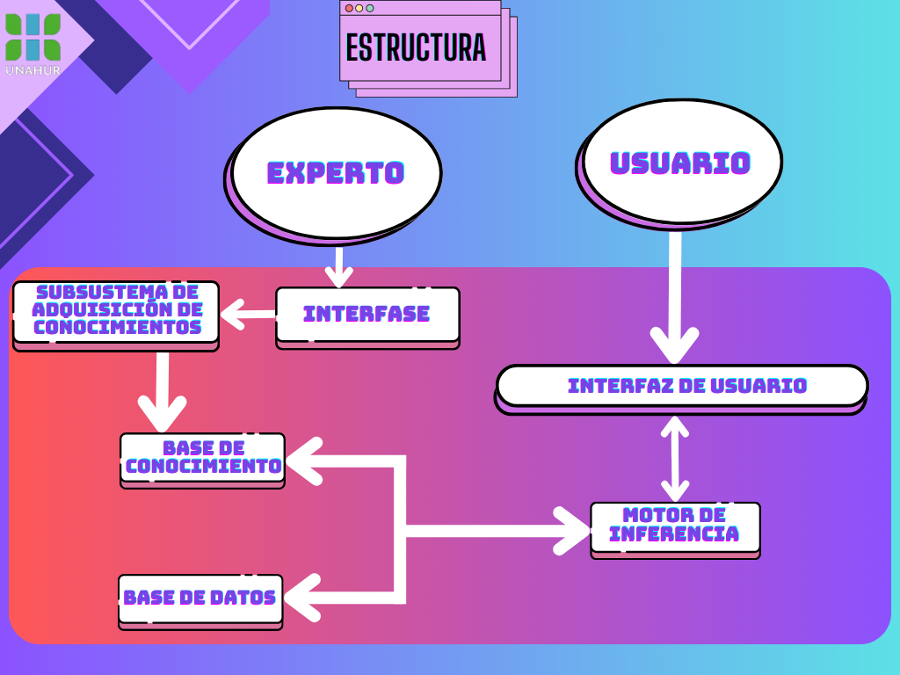

# Sistemas Expertos
### Docente
- Pandolfo Pablo

### Autores
- Matallana Diego
- Gomez Lautaro
- Farias Silvana

## Que es un Sistema Experto
Un Sistema Experto es un sistema que emplea conocimiento humano capturado en una computadora para resolver problemas que normalmente requieren de expertos humanos
### Caracteristicas
1. Lo fundamental es que ayuda a la toma de decisiones con la competencia de un experto, ya que lo que hacemos es volcar en dicho sistema el conocimiento que tienen los expertos humanos.
2. Representa el conocimiento basándose en la inferencia. La inferencia de las reglas que son depositadas dentro de la base de datos de conocimiento
3.  La inferencia se realiza mediante el tratamiento de un gran volumen de conocimiento de tipo teórico.
4.  El sistema razona sobre esas operaciones y ese razonamiento de tipo lógico basado en reglas. Si existe un antecedente y el consecuente se da y el consecuente es un hecho, se da entrada a una nueva regla.
5. Constituye un sistema que no es algorítmico : A pesar de los dos algoritmos base que utiliza dicho sistema para poder manejarse en realidad en sí el descubrimiento de la información no es un sistema algorítmico.
6. Admite una fácil modificación del conocimiento sin reprogramar el sistema. Aumentamos el conocimiento a medida que aumentamos las reglas, y vayamos modificando dichas reglas.
7. El usuario dialoga con un sistema natural.

### Experto Humano
Un experto humano es aquella persona la cual almacena conocimientos y experiencias para luego aplicarlos en la realización de tareas de una manera rápida y óptima, de la cantidad de información y experiencias guardadas, depende su efectividad.

### Estructura de un Sistema Experto

### Componentes de un Sistema Experto
1. **Base de Conocimiento**
   - Contiene el conocimiento y la experiencia de los expertos en un dominio determinado, convenientemente codificado, estructurado y formalizado para el posterior uso del mismo
2. **Base de Hechos o Datos**
   - Es la memoria de trabajo, una memoria temporal auxiliar que almacena los datos del usuario, los datos iniciales del problema y los resultados intermedios obternidos a los largo del proceso de consulta y resolución
3. **Motor de Inferencia**
   - Es la unidad logica encargada de manejar el proceso de selección, decisión, interpretación y aplicación del comportamiento que refleja el razonamiento, imitando el procedimiento humano de los expertos
4. **Interfaz de Usuario**
   - Gobierna el diálogo entre el sistema y el usuario, facilitando a este la posibilidad de consultas en un lenguaje lo más "natural" posible

### Tipos de Sistemas Expertos
1. **Basados en Reglas** (RBR o Rule Based Reasoning)
   - Estos sistemas utilizan una base de conocimiento compuesta por reglas if-then, donde las reglas representan el conocimiento y las decisiones del experto. El sistema aplica estas reglas a los datos de entrada para llegar a conclusiones o recomendaciones.
2. **Basados en Casos** (CBR o Case Based Reasoning)
   - Estos sistemas almacenan y utilizan una base de conocimiento compuesta por casos o ejemplos específicos.
   Cada caso contiene información detallada sobre una situación o problema y la solución correspondiente proporcionada por el experto. El sistema busca casos similares al problema actual y utiliza las soluciones pasadas como guía para resolver el problema actual
3. **Basados en Redes Bayesianas**
   - Un Sistema experto basado en redes bayesianas es un tipo de sistema que utiliza modelos probabilísticos llamados redes bayesianas para representar el conocimiento y el razonamiento experto. 
   Estas redes capturan las relaciones de dependencia entre variables y se utilizan para realizar inferencias y tomar decisiones basadas en la evidencia disponible. Estos sistemas son útiles en situaciones de incertidumbre y con datos limitados, y se aplican en campos como medicina, análisis de riesgos y toma de decisiones.
     - Una **red bayesiana** es un grafo acíclico dirigido en el que cada nodo representa una variable aleatoria que tiene asociada una función de probabilidad condicional. La estructura de la red bayesiana provee información sobre las relaciones de dependencia e independencia condicional existentes entre las variables.  

### Distintas aplicaciones de los Sistemas Expertos
- **Interpretacion**: Describen una situación a partir de unos datos proporcionados
- **Prediccion**: Deducen consecuencias futuras probables a partir de situaciones dadas
- **Diagnostico**: A partir de datos ( normalmente incompletos) averiguar la causa (Ej. Diagnóstico médico)
- **Diseño**: Construyen objetos a partir de ciertas restricciones dadas (Ej. CAD).
- **Planificacion**: Diseñan acciones, establecen cursos de acción ( Ej. Robots).
- **Control**: Realizan monitorización, corrección de errores y reparación de forma continua en el tiempo.
  - Dentro de este se realizan un conjunto de sistemas tales como:
    - **Monitorizacion**: Parecidos a la interpretación, pero además se detecta si la situación es normal o no.
    - **Correcion de errores**: Establece los fallos del problema y da soluciones para resolverlos.
    - **Reparacion**: Corrige los errores detectados para que vuelva a ser correcta la situación.

#### Ejemplos de Sistemas Expertos Reales

## Sistemas Expertos y PROLOG
Los ***sistemas expertos*** y ***Prolog*** están estrechamente relacionados, ya que Prolog es un lenguaje de programación lógica (como su nombre lo indica) que se utiliza normalmente para implementar sistemas expertos.
Prolog proporciona un conjunto de herramientas y características muy útiles para la construcción de S.E., como la inferencia basada en reglas y la manipulación de hechos y reglas.

### Relaciones entre los Sistemas Expertos y PROLOG

- **Representacion del Conocimiento**: Prolog permite representar el conocimiento utilizado en un sistema experto utilizando hechos y reglas
  - **Hechos**:  Estos pueden representar información objetiva y los predicados pueden representar relaciones entre diferentes conceptos.
  - **Reglas**: Estas pueden expresar el razonamiento y las inferencias lógicas utilizadas por el sistema experto.
- **Motor de Inferencia**: Prolog proporciona un motor de inferencia incorporado que puede realizar la inferencia lógica basada en las reglas y hechos definidos. Esto permite que el sistema experto realice deducciones y derive conclusiones a partir de la base de conocimiento.
- **Consultas y Respuestas**: Prolog permite realizar consultas para obtener respuestas basadas en la base de conocimiento del sistema experto. Es Posible hacer preguntas y obtener respuestas lógicas en forma de "verdadero" o "falso", o incluso obtener soluciones más detalladas utilizando variables lógicas.
- **Mantenimiento y Actualizacion de la Base de Conocimiento**: Prolog facilita la adición, modificación y eliminación de hechos y reglas en la base de conocimiento del sistema experto. Lo cual permite mantener y actualizar el conocimiento del sistema a medida que se adquiere nueva información o se realizan cambios en el dominio.

#### Conclusion
Prolog es una herramienta muy poderosa y útil para implementar sistemas expertos debido a su capacidad para representar el conocimiento, realizar inferencias lógicas y responder consultas. Proporciona un entorno flexible y robusto para construir sistemas expertos eficaces en diversos dominios.

#### Ejemplos de PROLOG

